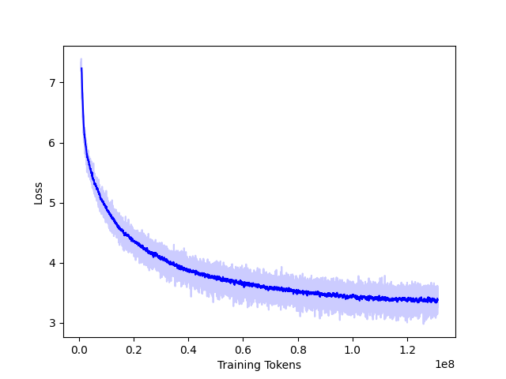

# GPT-Style Model

Simple version of GPT that can be used as a starting point for projects or research.

Use files in the following order:

- `download_data.py` to grab a dataset from huggingface and store in a single text file.
- `hftokenizer.py` to train a tokenizer on this data.
- `construct_dataset.py` to tokenize the data and pack into sequences of a given length, separated by EOS token.
- `train.py` to train a model and produce a loss curve
- `generate.py` to generate text with your trained model

Loss Curve:

Example Generations (**input in bold**):

**Steve Jobs was** filmed on both films from the late 1960s until production started at Simply Straight Studios in Springfield, California. Filming for Glastonbury Apocalypse and gig received minor filming locations across Europe as all western German ports had more free @-@ to @-@ back than Berlin'archives today ; only another ship set off Toronto boundaries of an artificial war surrounded by vehicle blocks which could be transported with lots or scrap metal banners made up within Shore

**In 1776, the American colonists** moved into Taunton and isolated in pursuit, a small number of advances brought from the colony. This enforced an economic expansion to it with mitigated immigrants who feared that freed slaves could pay their reward for themselves without slavery ( Mizemalez dissimilarly nevertheless pointed out later than did ) — this first time Martha Edward wrote nothing more about Henry's execution following his assassination – as she referred James de Gaulle to Lieutenant

**The Godfather is a film about** the negative effect of evil and soul. However, it was adapted into an abortive biography written by Herman Whitman in 1983 during Tree Films for which Tarantino compares her impression to Ikherjohn's book The Titans : An Adventure Time Christmas as its main villain who transcendes history with many defects such as children under birthboards that entertain people never enjoy their lives outside society or else will later serve usatically until human

### Extensions

To get improved (usable) results, train a sufficiently sized model over many billions of tokens. I highly recommend using multiple GPUs if available, and something like HF Accelerate. I may post a parallelized example at a later date.
If you are not looking to make changes to the GPT model but rather are trying to simply train a compoetent language model, I would not start with code that is this low-level. Pull down or build a huggingface model, (re)initialize the parameters, and use their ecosystem. 

### License

This work is authored by Ted Staley and is Copyright © 2024 The Johns Hopkins University Applied Physics Laboratory LLC, please see the LICENSE file.

